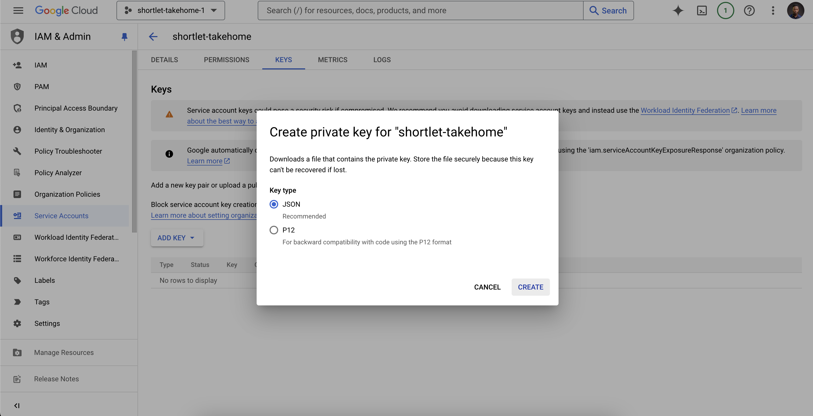

# Shortlet Takehome

Take home assessment for Shortlet Cloud Engineering role. Requirement is a simple dockerized web API that returns the current time in JSON format.

## Running the application

You can run the application directly on your local machine or using Docker.

### Running the application locally

1. Clone the repo
2. Run `go run main.go`
3. Open `http://localhost:4500/` in your browser

### Running via Docker

1. Clone the repo
2. Run `docker build -t shortlet-takehome .`
3. Run `docker run --rm -p 4500:4500 shortlet-takehome`
4. Open `http://localhost:4500/` in your browser

## Testing

The application has a single unit test that verifies that the API returns the current time in JSON format. You can run the tests by running `go test`

## Provisioning Resources via Terrraform

The repo contains a `terraform` directory that contains all the files required to set up a Kubernetes cluster, a node pool, a VPC, and the Kubernetes resources required to run the application.

Before you can provision this cluster, ensure you have terraform installed. You also need to have a GCP account and a GCP project. You can create a project by following the instructions [here](https://cloud.google.com/resource-manager/docs/creating-managing-projects).

### Creating the secrets files

After creating your project, set up the environment variables/secrets for this project. The basic terraform secrets are defined in a terraform.tfvars file. You can create this file from the sample file either through manual copy and paste or using the `cp` command like: `cp terraform/terraform.tfvars.sample terraform/terraform.tfvars`. Below is a sample content of the file:

```
project_id = "shortlet-takehome-3894"
region     = "us-central1"
certmanager_email = "johndoe@fakemail.com"
```

### Setting the GCP credentials

To set the GCP credentials, you need to create a service account and download the credentials file. You can create a service account by following the instructions [here](https://cloud.google.com/iam/docs/creating-managing-service-accounts). The basic idea is

After creating the service account, you need to create a key for the service account. You should create a JSON key as this is the recommended format as it's human readable and contains all the required information to authenticate with GCP.



After clicking create, your key will be downloaded to your computer. You can then move it to the terraform directory of this project and rename it to `terraform_credentials.json`.

### Setting up the terraform backend

With the key and terraform credentials in place, you can now set up the terraform backend. The terraform backend is used to store the state of the terraform resources. All that is needed to set up the backend is the bucket name. Since buckets are globally unique, you can use any name you want.

```hcl
terraform {
    backend "gcs" {
        credentials = "terraform_credentials.json"
        bucket = "cluster-tf-state-103"
    }
}
```

So create a new Google Cloud Storage (GCS) bucket with your desired name and set this as the value of the bucket in the `backend "gcs"` block.

## Provisioning the Infrastructure

To proceed with provisioning the infrastructure, you need to run the following commands in succession:

```sh
cd terraform
terraform init
terraform plan
terraform apply -auto-approve
```

terraform init installs the required plugins and terraform plan shows you the resources that will be created. If everything looks good, you can run terraform apply to create the resources.
